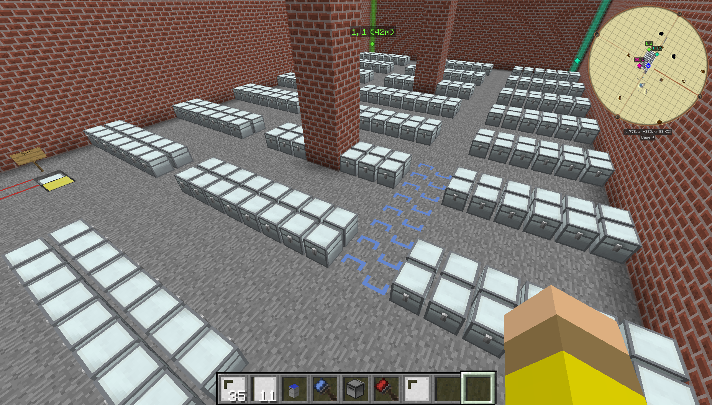

# Amazon Robot Warehouse in Minecraft

A fully automated warehouse system built inside Minecraft using [ComputerCraft](https://computercraft.info/), inspired by Amazon's warehouse robots. Turtles (programmable mining robots) navigate a grid of chests, receive orders from a central server, and deliver items autonomously — routed around obstacles and each other using a hand-rolled A\* pathfinding implementation.



## What is ComputerCraft?

ComputerCraft is a Minecraft mod that adds programmable computers and turtles to the game. Computers run Lua programs and can communicate wirelessly via `rednet` (think a LAN over in-game wireless modems). Turtles are robotic entities that can move, mine, place blocks, and interact with inventories — all under program control. They run on fuel, which in this case is coal.

## The Idea

After watching a YouTube video of Amazon's warehouse robots zipping around in coordinated swarms, the obvious question was: could you do something similar inside Minecraft?

The answer started small — get a turtle from point A to point B wirelessly. That grew into proper pathfinding so turtles could navigate around walls, chests, other turtles, and drop-off zones. Then came the discovery that ComputerCraft computers can make HTTP requests. That changed everything.

What if the warehouse had an actual storefront? A web interface where you could place orders — like Amazon — that would be written to a database, polled by the in-game computers, and fulfilled by the turtles? Not just a toy, but an end-to-end system that emulates the whole thing.

That's what this is.

## Architecture

```
Web Browser
└── PHP REST API (orders, items, chests, turtles, stations, nodes)
    └── Database Server (ComputerCraft computer)
        ├── Order Server        ─ manages order queue, dispatches turtles
        ├── Pathing Server      ─ A* pathfinding, returns routes on request
        ├── Item Server         ─ item catalogue
        ├── Error Server        ─ error logging
        ├── Refuel Server       ─ manages turtle coal refueling
        ├── Minecraft Command Server
        ├── Warehouse Monitor   ─ large in-game display of the warehouse
        ├── Master Server       ─ system-wide orchestration and UI
        └── Station (x N)       ─ input / output / transfer drop-off points

Turtles (x N)
  └── On boot, broadcast ROLLCALL to Order Server
  └── Receive order → request path from Pathing Server → navigate → complete order
```

All inter-process communication happens over ComputerCraft's `rednet` protocol (wireless modem messages). The PHP backend provides persistent storage across server restarts.

## How It Works

### Order lifecycle

1. An order is placed (via web interface or the in-game Master Server).
2. The Order Server picks it up and assigns it to a ready turtle.
3. The turtle broadcasts a `ROLLCALL` on boot and receives its assigned order, along with the full server topology.
4. The turtle requests a path from the Pathing Server: send current coordinates + destination, receive an ordered list of `{x, y}` waypoints.
5. The turtle navigates to the pickup station, collects the item, navigates to the destination chest, and deposits it.
6. The turtle reports `ORDER_COMPLETE` to the Order Server, which updates the database and either assigns a new order or sends the turtle back to its harbour.

### Stations

Stations are physical drop-off points with three modes:
- **Input** — accepts new items to be stored; periodically scans for items and generates input orders
- **Output** — delivers items requested for retrieval
- **Transfer** — collects items from multiple orders before dispatching

Stations use colour-coded ender chests to route items across the facility.

### Turtle fuelling

Turtles run on coal. A dedicated refuelling zone with a Refuel Server keeps the fleet stocked. Turtles check their fuel level and divert to the refuel station as needed.

## A\* Pathfinding

The Pathing Server implements A\* from scratch in Lua. It was reverse-engineered from a YouTube explanation — no reference implementation, no library.

The algorithm maintains open and closed node lists across a 25×50 block grid. Obstacle nodes (walls, chests, drop-off zones) are loaded from the Database Server at startup and can be added or removed at runtime. Path cost uses standard G + H scoring with a Manhattan distance heuristic.

```
G = cumulative movement cost from origin
H = Manhattan distance to destination × base cost
f = G + H
```

Once the goal node reaches the closed list, the route is traced back through parent references and reversed into a forward-ordered waypoint sequence.

A planned extension (listed in the design notes but never implemented) would have tracked which nodes were actively in use and reduced their traversal cost for turtles heading the same direction — effectively forming traffic lanes to reduce congestion when multiple turtles are active simultaneously.

## Planning Notes

The full feature set was designed on paper before implementation started. These notes date from December 2015.

| | |
|---|---|
|  |  |


The Monitor Server alone was planned to display: a live map of the warehouse floor with configurable overlay layers, real-time pathfinding visualisation, turtle statuses and fuel levels, total items stored, current orders (waiting/active/complete), storage warnings, and selectable chest contents. `Warehouse Monitor.lua` at ~50KB is the largest file in the repository.

## Where It Ended

The system reached a point where turtles were navigating, orders were being assigned and completed, and the pathfinder was working. Then the next requirement arrived: **full crash recovery**.

After a server restart or unexpected shutdown, each turtle needed to autonomously determine its grid position, recall which order it was fulfilling, inspect its own inventory, figure out whether it was inbound or outbound, and resume without human intervention. This filled an A2 sheet of paper with requirements and state-machine logic.

That was the point where the project was set down. Not because the idea was wrong — the requirements were correct — but because the implementation complexity exceeded what felt tractable at the time.

## Files

### ComputerCraft (Lua)

| File | Description |
|------|-------------|
| `Master Server.lua` | System-wide orchestration. Manages the warehouse UI, turtle fleet, station configuration, and overall system state (online / offline / repeat). |
| `Order Server.lua` | Order queue management. Receives new orders from stations and the web interface, assigns them to available turtles, handles rollcalls, and processes order completions. |
| `Pathing Server.lua` | A\* pathfinding. Accepts path requests from turtles and returns ordered waypoint sequences. Obstacle nodes loaded from the database and updateable at runtime. |
| `Database Server.lua` | Persistent storage proxy. Translates rednet requests from all other servers into HTTP calls to the PHP backend. |
| `Warehouse Monitor.lua` | Large in-game display. Real-time map of the warehouse floor, turtle positions, order status, and system health. |
| `Order Server.lua` | Order queue management and turtle dispatch. |
| `Item Server.lua` | Item catalogue. Tracks what is stored, where, and in what quantity. |
| `Error Server.lua` | Error logging and broadcast. |
| `Refuel Server.lua` | Turtle fuel management. |
| `Minceaft Command Server.lua` | Issues Minecraft server commands. |
| `Station.lua` | Template for input/output/transfer stations. Handles item scanning, order generation, and item handoff to turtles. |
| `Station_startup.lua` | Station boot script. |
| `Turtle.lua` | Early turtle movement prototype (hardcoded coordinates, predates the pathfinding system). |

### PHP Backend

| File | Description |
|------|-------------|
| `chests.php` | Chest locations, capacity, and status. |
| `items.php` | Item catalogue and current storage locations. |
| `orders.php` | Order queue (new / active / hold / complete). |
| `stations.php` | Station configuration and modes. |
| `nodes.php` | Grid node types (obstacle, chest, station). Used by the pathing server. |
| `turtles.php` | Turtle registry and status. |
| `errors.php` | Error log. |

## License

MIT
